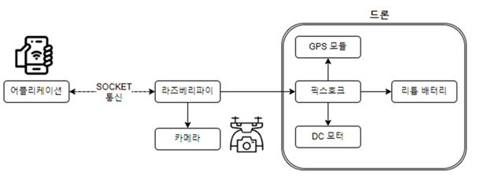
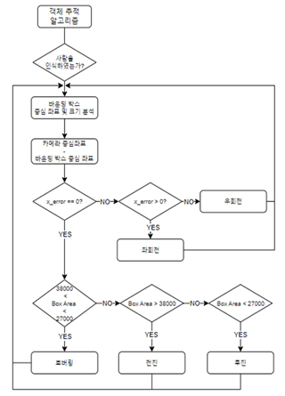
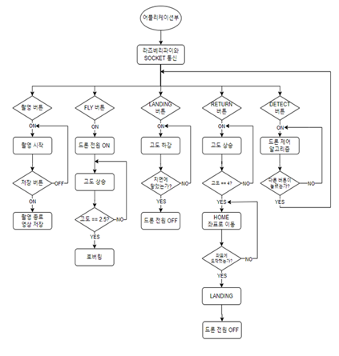
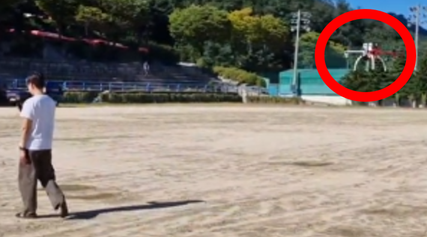
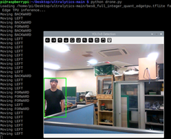

# 🛰️ Object Detection Autonomous Drone (YOLOv8 기반 자율주행 드론)

## 📌 프로젝트 개요  
사람이 직접 순찰하지 않아도 주변을 인식하며 따라다니는 **안전 귀가 드론**을 만들고자 프로젝트를 시작했습니다.  

이 드론은 **YOLOv8 객체 인식 모델**을 이용해 사람을 탐지하고,  
**라즈베리 파이(Raspberry Pi)** 에서 인식된 객체의 위치 정보를 기반으로 **Pixhawk** 비행 컨트롤러에 이동 명령을 전송하여  
자동으로 추적 및 이동하도록 설계되었습니다.  

또한, **Android Studio**를 이용해 제작한 모바일 앱을 통해  
사용자는 **드론 호출(Call)** 및 **착륙(Land)** 기능을 제어하고,  
실시간으로 촬영된 영상을 확인할 수 있습니다.

---

## ⚙️ 주요 기능  
- 🧍‍♂️ **객체 인식 (Object Detection)**  
  - YOLOv8 모델을 학습시켜 사람을 실시간으로 감지  
  - 인식된 객체에 바운딩 박스를 표시  

- 🚁 **자율주행 제어 (Autonomous Navigation)**  
  - 바운딩 박스의 위치를 분석하여 Raspberry Pi가 Pixhawk에 이동 명령 전송  
  - 객체 중심 추적 알고리즘을 이용해 자연스러운 이동 구현  

- 📱 **모바일 앱 연동 (Android Control App)**  
  - Android Studio 기반의 제어 앱 개발  
  - 드론 호출 / 착륙 기능 및 영상 스트리밍 지원  

---

## 🧠 기술 스택  
| 구분 | 사용 기술 |
|------|------------|
| **AI / Vision** | YOLOv8 (Ultralytics) |
| **임베디드 제어** | Raspberry Pi 4, Pixhawk Flight Controller |
| **언어** | Python |
| **모바일 앱** | Android Studio (Java / Kotlin) |
| **통신** | MAVLink |

---

## 👨‍💻 담당 역할 (My Role)  
- 팀장으로서 프로젝트의 **전체 일정 및 진행 관리** 담당  
- **YOLOv8 기반 객체 인식 모델** 구축 및 최적화 수행  
- 인식된 객체의 위치 정보 기반 **드론 이동 제어 로직 설계 및 구현**  
- 라즈베리 파이 ↔ Pixhawk 간 통신 및 명령 전달 기능 개발

---
  
## 🧩 시스템 구성도  
### 🔧 하드웨어 블록도  
드론의 전체 구성 요소를 나타낸 블록도입니다.  

### 🔄 시스템 플로우 차트  
데이터 흐름 구조를 나타낸 플로우 차트입니다.

  
  

---

## 🚀 결과  
- YOLOv8 모델을 통해 사람을 실시간으로 인식 및 추적  
- 인식된 객체 방향으로 자율 이동 및 정지 수행  
- 안드로이드 앱을 통한 드론 호출 및 영상 확인 가능  

  
  

---

## 🔬 향후 연구 및 개선 방향  
현재 시스템은 **프레임 내에서 감지된 사람 중 신뢰도(Confidence Score)** 가 가장 높은 객체를 추적 대상으로 선택하고 있습니다.  
하지만 프로젝트의 본래 목표는 **형광 조끼를 착용한 특정 인물을 인식**하는 것이었습니다.  

그러나 형광 조끼에 대한 **데이터 구축의 어려움**으로 인해  
이번 버전에서는 사람 인식 모델로 대체하였습니다.  

### 🎯 향후 개선 계획  
- 형광 조끼 전용 데이터셋 구축 및 커스텀 학습 진행  

---
